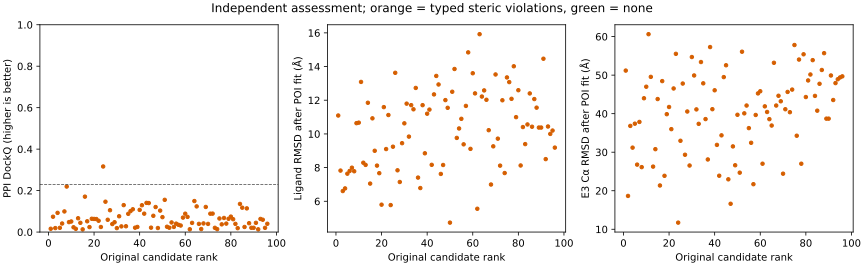
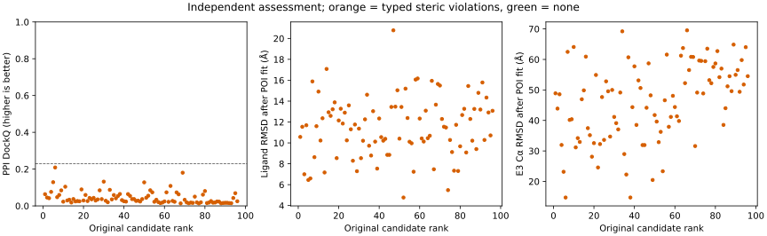

# P0: complete assessment of the unchanged baseline

Measured on 2026-09-12. The new evaluator assessed all 96 saved candidates for each original
control. No candidate was regenerated or reranked. All 46 original control files retain their
content hashes; the original baseline commit remains available.

| Endpoint | 5T35 | 6BOY |
|---|---:|---:|
| Candidates assessed | 96/96 | 96/96 |
| Rank-1 PPI DockQ | 0.01585 | 0.06362 |
| Highest sampled PPI DockQ | 0.31631, rank 24 | 0.20876, rank 6 |
| Candidates with DockQ ≥ 0.23 | 1 | 0 |
| PPI success@1 / @5 / @10 | No / No / No | No / No / No |
| Ligand symmetry RMSD ≤ 2 Å after POI fit | 0 | 0 |
| PoseBusters mol_fast plus defined stereo passes | 96 | 96 |
| Candidates with zero typed component clashes | 0 | 0 |
| Whole-head / joint assessment coverage | 0/96 | 0/96 |

The ligands retain acceptable internal geometry under the selected checks, while their
placement against the protein components fails the steric criterion. The one acceptable
5T35 PPI pose therefore does not establish a physically valid complete ternary prediction.
This supports prioritizing complete bound-head preservation and linker/interface sampling
in P1; it is not evidence that the accuracy problem has already been solved.

Whole-head and joint metrics are **unassessed**, because the baseline has ring anchors rather
than curated complete chemical heads. No zero, pass or claimed joint accuracy is substituted
for that missing coverage. The chemical endpoint is a PoseBusters subset, not full PB-valid.

Native self-comparisons give DockQ approximately one. Both native ligands pass mol_fast and
defined stereochemistry, and all native component typed-clash counts are zero. Native
controls validate this implementation on these two systems, not general predictive accuracy.

The installed evaluator used one thread. Numerical assessment took approximately 33.9 s
and 35.2 s, respectively, excluding final figure rendering. GNU time reported peak process
RSS of approximately 294 and 299 MiB; this is not the sum of simultaneous parent/child memory
or a hardware temperature guarantee. Exact observations and package versions are preserved
in [p0-results.json](p0-results.json).

## Source data and scientific figures

- [5T35 complete candidate data](p0-assessment-5t35.csv) and [vector figure](p0-assessment-5t35.svg).
- [6BOY complete candidate data](p0-assessment-6boy.csv) and [vector figure](p0-assessment-6boy.svg).
- [Frozen 43-entry inventory and 32 eligible systems](../benchmarks/inventory-v1.json).
- [Offline inventory verification](../benchmarks/verification-v1.json).

Figure caption: Every point is one originally ranked candidate. Orange indicates at least
one typed steric violation across POI/E3, POI/ligand or E3/ligand; green indicates none.
The dashed DockQ line marks 0.23. Ligand and E3 RMSDs follow POI heavy-atom alignment.
The figures show sampling/ranking diagnostics from two development controls, not held-out
prediction accuracy or independent observations for statistical inference.

The separate local `runs/accuracy-p0/<case>/report.html` files contain interactive plots,
all candidate rows, provenance and CSV/JSON/SVG/PDF/600-dpi PNG links. They are regenerable
using [ASSESSMENT.md](ASSESSMENT.md) and remain outside version control.

## Validation and remaining boundary

Fifteen automated tests passed with local crystal data and the installed optional evaluation
environment; one existing CUDA runtime test skipped in the sandbox. Tests exercised native
identity, rigid-transform and atom-order invariance, explicit mmCIF selections, whole-head
metrics, symmetry, chirality inversion, empty interfaces, corrupt files, optional-worker
failure reporting and protected-group leakage. The isolated wheel built successfully and
contains the CLI and standalone worker. Both installed reports passed offline Chromium checks
for all three charts, 96 candidate rows, pointer hover and absence of JavaScript errors or HTTP requests.

The protected split contains 16 development, 10 validation and 6 test systems. Test references
were inspected only for structural curation; no TOPICS test predictions were run. Runnable
benchmark inputs, chemical annotations and process budget enforcement remain prerequisites
for a full P1–P4 comparison. Training overlap for learned engines remains unknown.
